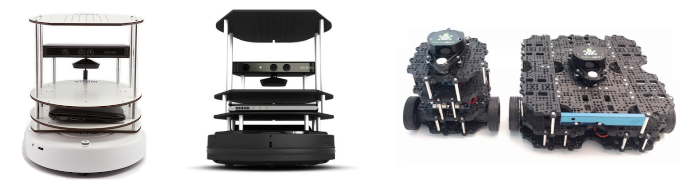

.. _about:

.. image:: images/turtlebot_logo_tm.png

About
=====

What is a TurtleBot?
--------------------

.. image:: images/turtlebot_rider.jpeg

TurtleBot is a low-cost, personal robot kit with open-source software. TurtleBot was created at Willow Garage by Melonee Wise and Tully Foote in November 2010. With TurtleBot, you’ll be able to build a robot that can drive around your house, see in 3D, and have enough horsepower to create exciting applications.

The TurtleBot kit consists of a mobile base, 2D/3D distance sensor, laptop computer or SBC(Single Board Computer), and the TurtleBot mounting hardware kit. In addition to the TurtleBot kit, users can download the TurtleBot SDK from the ROS wiki. TurtleBot is designed to be easy to buy, build, and assemble, using off the shelf consumer products and parts that easily can be created from standard materials. As an entry level mobile robotics platform, TurtleBot has many of the same capabilities of the company's larger robotics platforms, like PR2.

For more information
~~~~~~~~~~~~~~~~~~~~

For more information, we recommend an interview with TurtleBot creators, Tully Foote and Melonee Wise.

- `TurtleBot Inventors Tell Us Everything About the Robot`_ (IEEE Spectrum, By Evan Ackerman, 26 Mar 2013)

.. _TurtleBot Inventors Tell Us Everything About the Robot: http://spectrum.ieee.org/automaton/robotics/diy/interview-turtlebot-inventors-tell-us-everything-about-the-robot

Core Technology
---------------

.. image:: images/nav_comic.png

The TurtleBot's core technology is SLAM and Navigation, making it suitable for home service robots. The TurtleBot can run SLAM(simultaneous localization and mapping) algorithms to build a map and can drive around your room. Also, it can be controlled remotely from a laptop, joypad or Android-based smart phone. The TurtleBot can also follow a person's legs as they walk in a room. Also included are the ROS arm navigation capabilities, an arm attachment that has been developed for manipulating objects.

History
-------

TurtleBot1
~~~~~~~~~~

TurtleBot1 consists of an iRobot Create base, a 3,000mAh battery pack, a TurtleBot power board with gyro, a Kinect sensor, an Asus 1215N laptop with a dual core processor, and a hardware mounting kit attaching everything together and adding future sensors. The first TurtleBot was created at Willow Garage by Melonee Wise and Tully Foote in November 2010.

TurtleBot2
~~~~~~~~~~

TurtleBot2 consists of an Yujin Kobuki base, a 2,200mAh battery pack, a Kinect sensor, an Asus 1215N laptop with a dual core processor, fast charger, charging dock, and a hardware mounting kit attaching everything together and adding future sensors.

TurtleBot3
~~~~~~~~~~

TurtleBot3 is made up of modular plates that users can customize the shape. Available in two sizes: small size BURGER and medium size WAFFLE. TurtleBot3 consists of a base, a 1,800mAh battery pack, a 360 degree LIDAR(+ RealSense camera for WAFFLE kit), an SBC(single board computer: Raspberry PI 3 and Intel Joule 570x) and a hardware mounting kit attaching everything together and adding future sensors.

TurtleBot From Wikipedia
~~~~~~~~~~~~~~~~~~~~~~~~

https://en.wikipedia.org/wiki/Turtlebot

.. toctree::
   :numbered:
   :maxdepth: 1
