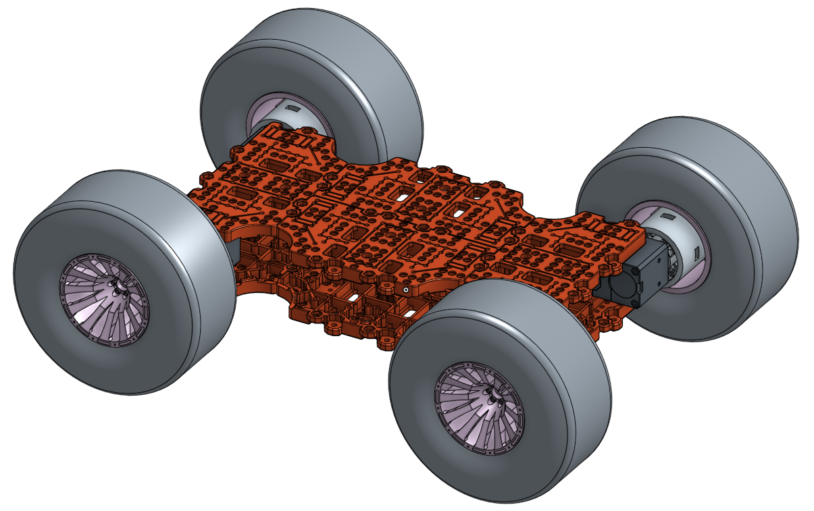

Friends
=======

In the video, see how the TurtleBot3 can be assembled and reassembled, using some small parts. The waffle plate, a biggest part in the TurtleBot3 components that can make various size and shape of robot, is consisted of several size of holes, and needs few kind of volts and nuts to assembly.

.. raw:: html

  <iframe width="640" height="360" src="https://www.youtube.com/embed/o9d7NVC0A1Y" frameborder="0" allowfullscreen></iframe>

|

From this idea, a lot of TurtleBot3 friends that have different characters can be built. Customize the construction more than listed as follows.

TurtleBot3 Friends List (2017.03.03)

- TurtleBot3 Friends: Car
- TurtleBot3 Friends: OpenManipulator Chain
- TurtleBot3 Friends: Segway
- TurtleBot3 Friends: Conveyor
- TurtleBot3 Friends: Monster
- TurtleBot3 Friends: Tank
- TurtleBot3 Friends: Omni
- TurtleBot3 Friends: Mecanum
- TurtleBot3 Friends: Bike
- TurtleBot3 Friends: Road Train
- TurtleBot3 Friends: Real TurtleBot
- TurtleBot3 Friends: Carrier

.. image:: _static/friends/All_friends.jpg

.. raw:: html

  <iframe width="560" height="315" src="https://www.youtube.com/embed/gI0T4-aqTpI" frameborder="0" allowfullscreen></iframe>

|

Get sources and make friends! To do this, see ``Examples`` → ``turtlebot3`` → ``turtlebot3_friends``

.. image:: _static/friends/ide.png

.. NOTE:: Any suggestions, any ideas, any applicants for this TurtleBot3 Friends Project is welcomed. We want to welcome our new TurtleBot3 Friends. If you have TurtleBot3 Friends who realized your new idea, please let us know. We will be introducing your robot to this wiki page. :)

:E-Mail: ost@robotis.com

TurtleBot3 Friends: Car
------------------------

:``Type``: RC Car
:``Features``: About 1:2 gear ratio, differential gears want to make Car be in the Formula E!
:``Components``: Two Dynamixel X 430 Series (One for steering, one for driving), an OpenCR Board, a RC100 Remote Controller with BT410 master-slave Bluetooth modules, TurtleBot3 Chassis and Battery, OLLO plastic frames.
:``Hardware``: (coming soon)
:``Software``: ``Examples`` → ``turtlebot3`` → ``turtlebot3_friends`` → ``turtlebot3_car``
:``Video``:

.. _section_auto:

.. raw:: html

  <iframe width="640" height="360" src="https://www.youtube.com/embed/IkPexspUgKk" frameborder="0" allowfullscreen></iframe>

|

.. raw:: html

  <iframe width="640" height="360" src="https://www.youtube.com/embed/1V33iEu4ylw" frameborder="0" allowfullscreen></iframe>

|

TurtleBot3 Friends: OpenManipulator Chain
-----------------------------------------

.. image:: _static/friends/friends_open_manipulator_waffle.png

:``Type``: Manipulator 4 DOF + 1 Gripper
:``Features``: Compatible with TurtleBot3 Waffle and it has linear gripper for pick and place.
:``Components``: Four Dynamixel X 430 Series (Four for joints, one for gripper), an OpenCR Board, 3D printed chassis.
:``Hardware``: https://goo.gl/xgxh2G (TB3 Waffle + OpenManipulator Chain)
:``Hardware``: https://goo.gl/Wv3KON (OpenManipulator Chain)
:``Software``: https://github.com/ROBOTIS-GIT/open_manipulator (We are preparing for OpenCR Example)
:``Video``:

.. raw:: html

  <iframe width="640" height="360" src="https://www.youtube.com/embed/Qhvk5cnX2hM" frameborder="0" allowfullscreen></iframe>

|

.. raw:: html

  <iframe width="640" height="360" src="https://www.youtube.com/embed/qbht0ssv8M0" frameborder="0" allowfullscreen></iframe>

|

TurtleBot3 Friends: Segway
--------------------------

.. image:: _static/friends/friends_segway.png

:``Type``: Segway robot
:``Features``: Balancing with only two DYNAMIXEL by applying PID controller.
:``Components``: Two Dynamixel X 430 Series (All for balancing), an OpenCR Board, TurtleBot3 Chassis and Battery, 3D printed chassis.
:``Hardware``: https://goo.gl/DsQXaR
:``Software``: ``Examples`` → ``turtlebot3`` → ``turtlebot3_friends`` → ``turtlebot3_segway``
:``Video``:

.. raw:: html

  <iframe width="640" height="360" src="https://www.youtube.com/embed/VAY-0xBOE2g" frameborder="0" allowfullscreen></iframe>

|

TurtleBot3 Friends: Conveyor
----------------------------

.. image:: _static/friends/friends_conveyor.png

:``Type``: 4 Wheel parallel translation vehicle
:``Features``: 4 Joints and 4 wheels will become a futuristic technology on transportation society by overcoming fuel-consuming mechanics.
:``Components``: Eight Dynamixel X 430 Series (Four for steering, four for driving), an OpenCR Board, a RC100 Remote Controller with BT410 master-slave Bluetooth modules, TurtleBot3 Chassis and Battery, 3D printed chassis.
:``Hardware``: https://goo.gl/cym7dX
:``Software``: ``Examples`` → ``turtlebot3`` → ``turtlebot3_friends`` → ``turtlebot3_conveyor``
:``Video``:

.. raw:: html

  <iframe width="640" height="360" src="https://www.youtube.com/embed/uv2faO7GhXc" frameborder="0" allowfullscreen></iframe>

|

.. _section_monster:

TurtleBot3 Friends: Monster
---------------------------

:``Type``: 4WD Car
:``Features``: 4 Big wheels let it be strong in the rough terrain or even a big difference of elevation.
:``Components``: Four Dynamixel X 430 Series (All for driving), an OpenCR Board, a RC100 Remote Controller with BT410 master-slave Bluetooth modules, TurtleBot3 Chassis and Battery, 3D printed chassis.
:``Hardware``: https://goo.gl/YnUrEo
:``Software``: ``Examples`` → ``turtlebot3`` → ``turtlebot3_friends`` → ``turtlebot3_monster``
:``Video``:

.. raw:: html

  <iframe width="640" height="360" src="https://www.youtube.com/embed/UqdwGLH1-cA" frameborder="0" allowfullscreen></iframe>

|

TurtleBot3 Friends: Tank
------------------------

.. image:: _static/friends/friends_tank.png

:``Type``: Caterpillar
:``Features``: Caterpillar units which are connected and assembled on sprocket wheels make it be strong in the rough terrain.
:``Components``: Two Dynamixel X 430 Series (All for driving), an OpenCR Board, a RC100 Remote Controller with BT410 master-slave Bluetooth modules, TurtleBot3 Chassis and Battery, Caterpillar Unit, 3D printed chassis.
:``Hardware``: https://goo.gl/IUPwd9
:``Software``: ``Examples`` → ``turtlebot3`` → ``turtlebot3_friends`` → ``turtlebot3_tank``
:``Video``:

.. raw:: html

  <iframe width="640" height="360" src="https://www.youtube.com/embed/vndnwpVEpVE" frameborder="0" allowfullscreen></iframe>

|

.. _section_omni:

TurtleBot3 Friends: Omni
------------------------

.. image:: _static/friends/friends_omni.png

:``Type``: Omni wheel
:``Features``: Omni wheels have additional discs around the circumference make it be drive laterally.
:``Components``: Three Dynamixel X 430 Series (All for driving), an OpenCR Board, a RC100 Remote Controller with BT410 master-slave Bluetooth modules, TurtleBot3 Chassis and Battery, 3D printed chassis.
:``Hardware``: https://goo.gl/WB8u3r
:``Software``: ``Examples`` → ``turtlebot3`` → ``turtlebot3_friends`` → ``turtlebot3_omni``
:``Video``:

.. raw:: html

  <iframe width="640" height="360" src="https://www.youtube.com/embed/r8wRACM_ZbE" frameborder="0" allowfullscreen></iframe>

|

TurtleBot3 Friends: Mecanum
---------------------------

.. image:: _static/friends/friends_mecanum.png

:``Type``: Mecanum wheel
:``Features``: Mecanum wheels have additional discs around the circumference let it be drive laterally.
:``Components``: Four Dynamixel X 430 Series (All for driving), an OpenCR Board, a RC100 Remote Controller with BT410 master-slave Bluetooth modules, TurtleBot3 Chassis and Battery, 3D printed chassis.
:``Hardware``: https://goo.gl/Nz1VE0
:``Software``: ``Examples`` → ``turtlebot3`` → ``turtlebot3_friends`` → ``turtlebot3_mechanum``
:``Video``: See in the video :ref:`Friends-Omni<omni>` above.

TurtleBot3 Friends: Bike
------------------------

.. image:: _static/friends/friends_bike.png

:``Type``: 3-DOF Motorcycle
:``Features``: Cute 3-wheeled bikey reveals its existence on the "Car" film as a brother of the "Car".
:``Components``: Three Dynamixel X 430 Series (One for steering, two for driving), an OpenCR Board, a RC100 Remote Controller with BT410 master-slave Bluetooth modules, TurtleBot3 Chassis and Battery, 3D printed chassis.
:``Hardware``: https://goo.gl/9UuCJn
:``Software``: ``Examples`` → ``turtlebot3`` → ``turtlebot3_friends`` → ``turtlebot3_bike``
:``Video``: See in the videos :ref:`Friends-Auto<section_auto>` and :ref:`Friends-Monster<section_monster>` above.

TurtleBot3 Friends: Road Train
------------------------------

.. image:: _static/friends/friends_road_train.png

:``Type``: Road train
:``Features``: Road train can connect vehicles and it can serve various things! 
:``Components``: Two Dynamixel XM-430 Series (two for driving), an OpenCR Board, a RC100 Remote Controller with BT410 master-slave Bluetooth modules, TurtleBot3 Chassis and Battery, 3D printed chassis.
:``Hardware``: https://goo.gl/aXX06O
:``Software``: ``Examples`` → ``turtlebot3`` → ``turtlebot3_friends`` → ``turtlebot3_road_train``
:``Video``:

.. raw:: html

  <iframe width="640" height="360" src="https://www.youtube.com/embed/uhkq1w4YoEE" frameborder="0" allowfullscreen></iframe>

|

TurtleBot3 Friends: Real TurtleBot
----------------------------------

.. image:: _static/friends/friends_real.png

:``Type``: 8-DOF legged robot (a.k.a. Real TurtleBot)
:``Features``: A real TurtleBot will make most of the fanpics in the turtlebot society!.
:``Components``: Ten Dynamixel X 430 Series (Four for leg joint, another four for shoulder joint, two for head), an OpenCR Board, a RC100 Remote Controller with BT410 master-slave Bluetooth modules, TurtleBot3 Chassis and Battery, 3D printed chassis.
:``Hardware``: https://goo.gl/GAIXLI
:``Software``: ``Examples`` → ``turtlebot3`` → ``turtlebot3_friends`` → ``turtlebot3_realturtlebot``
:``Video``:

.. raw:: html

  <iframe width="640" height="360" src="https://www.youtube.com/embed/KNWkAe0ob9g" frameborder="0" allowfullscreen></iframe>

|

.. raw:: html

  <iframe width="640" height="360" src="https://www.youtube.com/embed/vort-z9HDlU" frameborder="0" allowfullscreen></iframe>

|

TurtleBot3 Friends: Carrier
----------------------------

.. image::

:``Type``: 2 Wheel mobile based platform as service robot
:``Features``: 4 Joints and 4 wheels will become a futuristic technology on transportation society by overcoming fuel-consuming mechanics.
:``Components``: A TurtleBot3 Waffle, 6 supports for 4th layer, another 6 supports for 5th layer construction, extra Waffle Plates in each layers, customized 3D printed wheel and ball caster.
:``Hardware``:
:``Software``: ``Examples`` → ``turtlebot3`` → ``turtlebot3_waffle`` → ``turtlebot3_waffle``
:``Video``:

.. raw:: html
