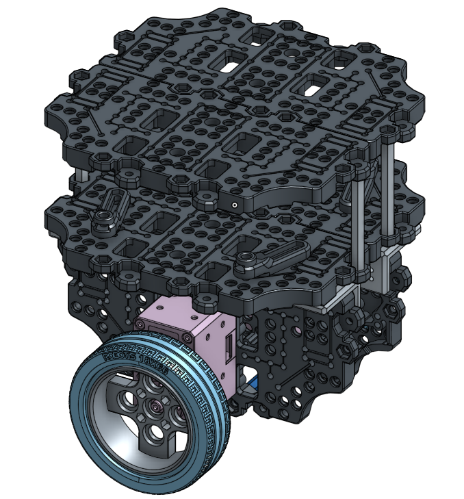
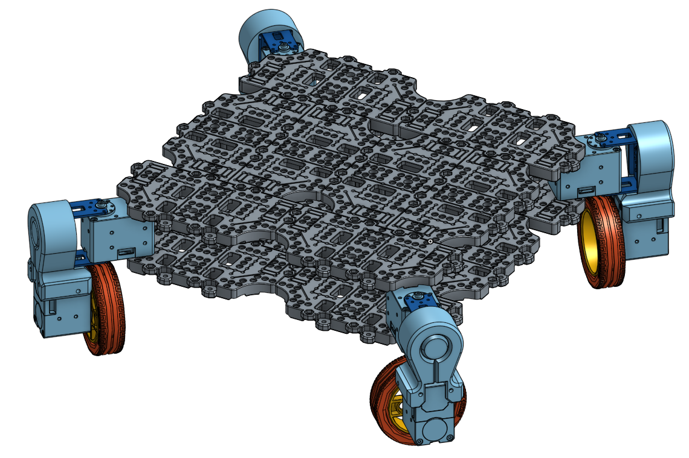
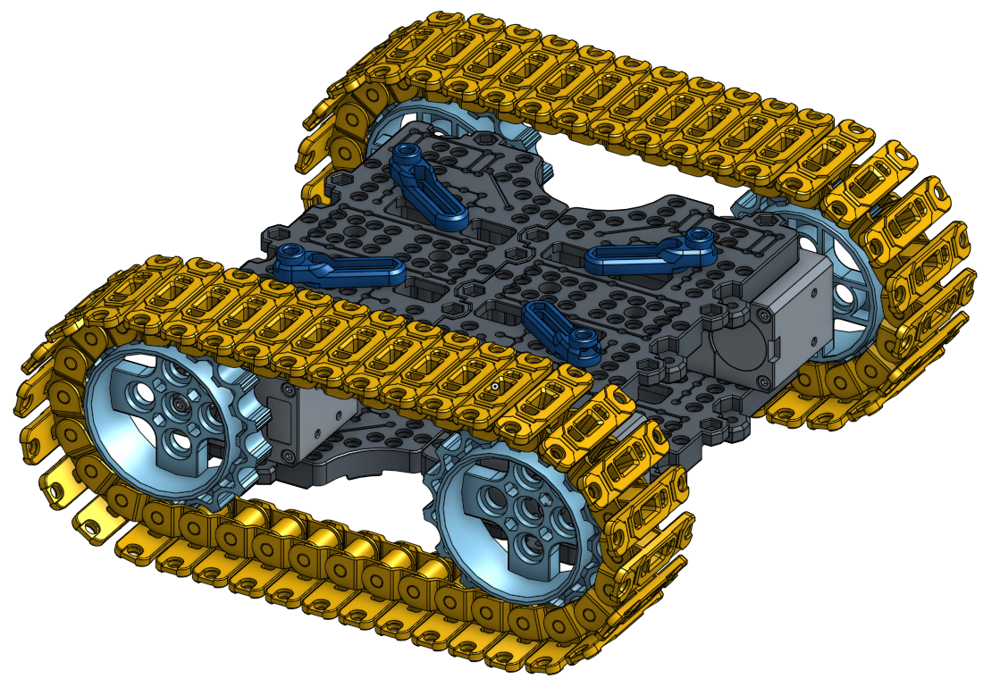
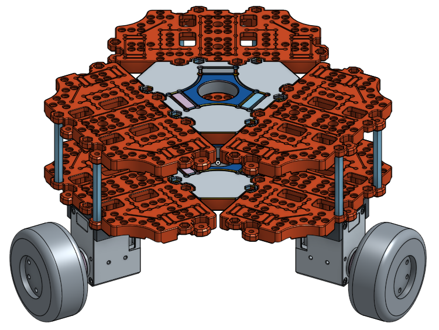
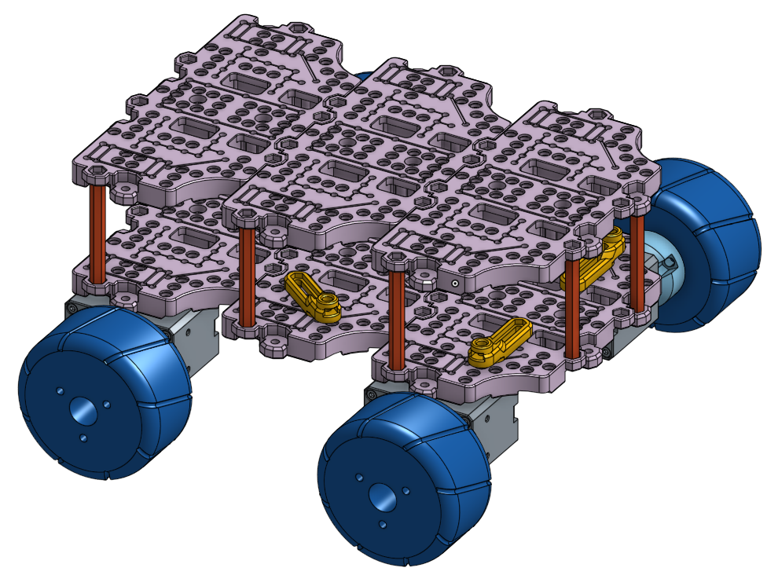
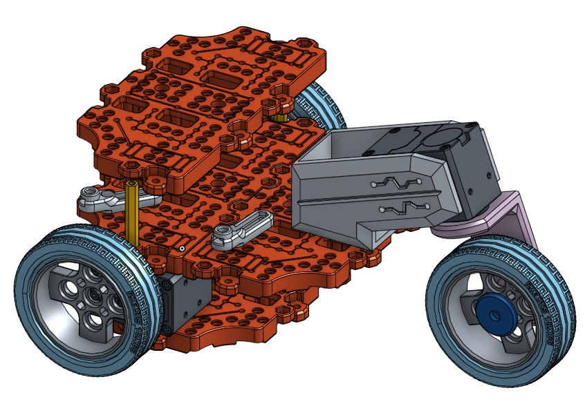
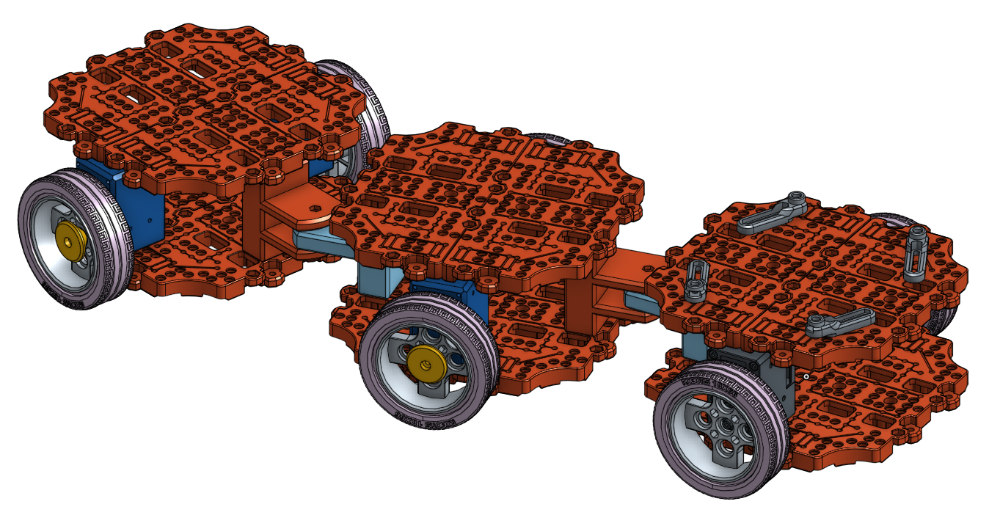
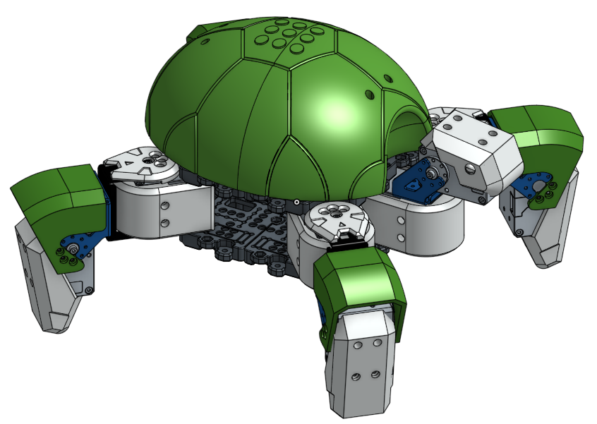

Friends
=======

In the video, see how the TurtleBot3 can be assembled and reassembled, using some small parts. The waffle plate, a biggest part in the TurtleBot3 components that can make various size and shape of robot, is consisted of several size of holes, and needs few kind of volts and nuts to assembly.

.. raw:: html

  <iframe width="640" height="360" src="https://www.youtube.com/embed/o9d7NVC0A1Y" frameborder="0" allowfullscreen></iframe>

|

From this idea, a lot of TurtleBot3 friends that have different characters can be built. Customize the construction more than listed as follows.

TurtleBot3 Friends List (2017.03.03)

- TurtleBot3 Friends: Car
- TurtleBot3 Friends: OpenManipulator Chain
- TurtleBot3 Friends: Segway
- TurtleBot3 Friends: Conveyor
- TurtleBot3 Friends: Monster
- TurtleBot3 Friends: Tank
- TurtleBot3 Friends: Omni
- TurtleBot3 Friends: Mecanum
- TurtleBot3 Friends: Bike
- TurtleBot3 Friends: Road Train
- TurtleBot3 Friends: Real TurtleBot

.. NOTE:: Any suggestions, any ideas, any applicants for this TurtleBot3 Friends Project is welcomed. We want to welcome our new TurtleBot3 Friends. If you have TurtleBot3 Friends who realized your new idea, please let us know. We will be introducing your robot to this wiki page. :) [email] ost@robotis.com

TurtleBot3 Friends: Car
------------------------

- ``Features``: About 1:2 gear ratio, differential gears want to make the Car be in the Formula E!
- ``Composition``: Two Dynamixel XM-430 Series (One for steering, one for driving), an OpenCR Board, a RC100 Remote Controller with BT410 master-slave Bluetooth modules, TURTLEBOT3 Chassis and Battery, OLLO plastic frames.
- ``Hardware``: (coming soon)
- ``Software``: (coming soon)

.. _auto:

.. raw:: html

  <iframe width="640" height="360" src="https://www.youtube.com/embed/IkPexspUgKk" frameborder="0" allowfullscreen></iframe>

|

.. raw:: html

  <iframe width="640" height="360" src="https://www.youtube.com/embed/1V33iEu4ylw" frameborder="0" allowfullscreen></iframe>

|

TurtleBot3 Friends: OpenManipulator Chain
-----------------------------------------

.. image:: _static/friends/friends_open_manipulator.png

- ``Type``: Manipulator 4 DOF + 1 Gripper
- ``Hardware``: https://goo.gl/Wv3KON
- ``Software``: (coming soon)
- ``Video``:

.. raw:: html

  <iframe width="640" height="360" src="https://www.youtube.com/embed/Qhvk5cnX2hM" frameborder="0" allowfullscreen></iframe>

|

.. raw:: html

  <iframe width="640" height="360" src="https://www.youtube.com/embed/qbht0ssv8M0" frameborder="0" allowfullscreen></iframe>

|

TurtleBot3 Friends: Segway
--------------------------

- ``Type``: Segway robot
- ``Hardware``: https://goo.gl/DsQXaR
- ``Software``: (coming soon)
- ``Video``:

.. raw:: html

  <iframe width="640" height="360" src="https://www.youtube.com/embed/VAY-0xBOE2g" frameborder="0" allowfullscreen></iframe>

|

TurtleBot3 Friends: Conveyor
----------------------------

- ``Features``: 4 Joints and 4 wheels will become a futuristic technology on transportation society by overcoming fuel-consuming mechanics.
- ``Composition``: Eight Dynamixel XM-430 Series (Four for steering, four for driving), an OpenCR Board, a RC100 Remote Controller with BT410 master-slave Bluetooth modules, TURTLEBOT3 Chassis and Battery, 3D printed chassis.
- ``Hardware``: https://goo.gl/cym7dX
- ``Software``: (coming soon)
- ``Video``:

.. raw:: html

  <iframe width="640" height="360" src="https://www.youtube.com/embed/uv2faO7GhXc" frameborder="0" allowfullscreen></iframe>

|

.. _monster:

TurtleBot3 Friends: Monster
---------------------------

- ``Type``: 4WD Car
- ``Features``: 4 Big wheels let it be strong in the rough terrain or even a big difference of elevation.
- ``Composition``: Four Dynamixel XM-430 Series (All for driving), an OpenCR Board, a RC100 Remote Controller with BT410 master-slave Bluetooth modules, TURTLEBOT3 Chassis and Battery, 3D printed chassis.
- ``Hardware``: (coming soon)
- ``Software``: (coming soon)

.. raw:: html

  <iframe width="640" height="360" src="https://www.youtube.com/embed/UqdwGLH1-cA" frameborder="0" allowfullscreen></iframe>

|

TurtleBot3 Friends: Tank
------------------------

- ``Type``: Caterpillar
- ``Hardware``: https://goo.gl/IUPwd9
- ``Software``: (coming soon)
- ``Video``:

.. raw:: html

  <iframe width="640" height="360" src="https://www.youtube.com/embed/vndnwpVEpVE" frameborder="0" allowfullscreen></iframe>

|

.. _omni:

TurtleBot3 Friends: Omni
------------------------

- ``Type``: Omni wheel
- ``Hardware``: https://goo.gl/WB8u3r
- ``Software``: (coming soon)
- ``Video``:

.. raw:: html

  <iframe width="640" height="360" src="https://www.youtube.com/embed/r8wRACM_ZbE" frameborder="0" allowfullscreen></iframe>

|

TurtleBot3 Friends: Mecanum
---------------------------

- ``Type``: Mecanum wheel
- ``Hardware``: https://goo.gl/Nz1VE0
- ``Software``: (coming soon)
- ``Video``: See in the video :ref:`Friends-Omni<omni>` above.

TurtleBot3 Friends: Bike
------------------------------

- ``Type``: 3-DOF Motorcycle
- ``Features``: Cute 3-wheeled bikey reveals its existence on the "Car" film as a brother of the "Car".
- ``Composition``: Three Dynamixel XM-430 Series (One for steering, two for driving), an OpenCR Board, a RC100 Remote Controller with BT410 master-slave Bluetooth modules, TURTLEBOT3 Chassis and Battery, 3D printed chassis.
- ``Hardware``: https://goo.gl/9UuCJn
- ``Software``: (coming soon)
- ``Video``: See in the videos :ref:`Friends-Auto<auto>` and :ref:`Friends-Monster<monster>` above.

TurtleBot3 Friends: Road Train
-------------------------

- ``Type``: Road train
- ``Hardware``: https://goo.gl/aXX06O
- ``Software``: (coming soon)
- ``Video``:

.. raw:: html

  <iframe width="640" height="360" src="https://www.youtube.com/embed/uhkq1w4YoEE" frameborder="0" allowfullscreen></iframe>

|

TurtleBot3 Friends: Real TurtleBot
----------------------------------

:``Type``: 8-DOF legged robot (a.k.a. Real TurtleBot)
:``Features``: A real TURTLEBOT will make most of the fanpics in the turtlebot society!.
:``Composition``: Ten Dynamixel XM-430 Series (Four for leg joint, another four for shoulder joint, two for head), an OpenCR Board, a RC100 Remote Controller with BT410 master-slave Bluetooth modules, TURTLEBOT3 Chassis and Battery, 3D printed chassis.
:``Hardware``: https://goo.gl/GAIXLI
:``Software``: (coming soon)
:``Video``:

.. raw:: html

  <iframe width="640" height="360" src="https://www.youtube.com/embed/KNWkAe0ob9g" frameborder="0" allowfullscreen></iframe>

|

.. raw:: html

  <iframe width="640" height="360" src="https://www.youtube.com/embed/vort-z9HDlU" frameborder="0" allowfullscreen></iframe>

|
