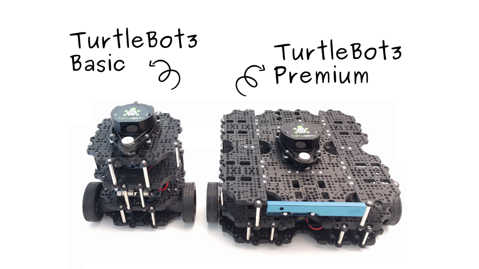

Hardware Setup
==============

Components
----------

The TurtleBot3 has two different models: the Basic and the Premium. The following list shows their components. The big differences between two models are the Motor, the SBC and the Sensor.

+------------+--------------------------+--------+---------+
| The number of the parts of each model | Basic  | Premium |
+============+==========================+========+=========+
|            | Waffle-plate             | 8      | 24      |
+            +--------------------------+--------+---------+
|            | Plate-support            | 10     | 20      |
+            +--------------------------+--------+---------+
|            | Board-support            | 10     | 10      |
+            +--------------------------+--------+---------+
|            | Wheel                    | 2      | 2       |
+            +--------------------------+--------+---------+
| Frame      | Rubber tire              | 2      | 2       |
+            +--------------------------+--------+---------+
| Wheel      | Ball caster              | 1      | 2       |
+            +--------------------------+--------+---------+
|            | Bolt and nut set         | 1      | 1       |
+            +--------------------------+--------+---------+
|            | Dream plate 5x5 K        | 1      | 1       |
+            +--------------------------+--------+---------+
|            | Dream L-bracket 2P K     | 1      | 1       |
+            +--------------------------+--------+---------+
|            | Rivet set                | 10     | 10      |
+------------+--------------------------+--------+---------+
|            | XL430-W350-T             | 2      | x       |
+            +--------------------------+--------+---------+
|            | Horn for XL430           | 2      | x       |
+ Motor      +--------------------------+--------+---------+
|            | XM430-W350-T             | x      | 2       |
+            +--------------------------+--------+---------+
|            | Horn for XM430           | x      | 2       |
+------------+--------------------------+--------+---------+
| Controller | OpenCR                   | 1      | 1       |
+------------+--------------------------+--------+---------+
|            | SMPS 12V 5A              | 1      | 1       |
+            +--------------------------+--------+---------+
|            | LIPO 11.1V 1800mAh       | 1      | 1       |
+            +--------------------------+--------+---------+
| Power      | Battery conversion cable | 1      | 1       |
+            +--------------------------+--------+---------+
| Battery    | Velcro                   | 2      | 2       |
+            +--------------------------+--------+---------+
| Cable      | Robot Cable-X3P 180mm    | 2      | 2       |
+            +--------------------------+--------+---------+
|            | Robot Cable-X3P 240mm    | x      | 2       |
+            +--------------------------+--------+---------+
|            | LIPO Battery Charger     | 1      | 1       |
+            +--------------------------+--------+---------+
|            | MicroUSB cable           | 1      | 1       |
+            +--------------------------+--------+---------+
|            | SBC power cable          | 1      | 1       |
+------------+--------------------------+--------+---------+
|            | RaspberryPi 3 model B    | 1      | x       |
+ SBC        +--------------------------+--------+---------+
|            | Intel Joule              | x      | 1       |
+------------+--------------------------+--------+---------+
|            | Laser Distance Sensor    | 1      | 1       |
+ Sensor     +--------------------------+--------+---------+
|            | Intel Realsense R200/400 | x      | 1       |
+------------+--------------------------+--------+---------+

Assembling
----------

TurtleBots are delivered in a single package, not each assembly. In order for the user to use TurtleBot, it is necessary to assemble according to the following procedure.

Basic model
~~~~~~~~~~~

.. raw:: html

  <iframe width="640" height="360" src="https://www.youtube.com/embed/rvm-m2ogrLA" frameborder="0" allowfullscreen></iframe>

|

Premium model
~~~~~~~~~~~~~

.. raw:: html

  <iframe width="640" height="360" src="https://www.youtube.com/embed/1nTMyr4ybi0" frameborder="0" allowfullscreen></iframe>

|
