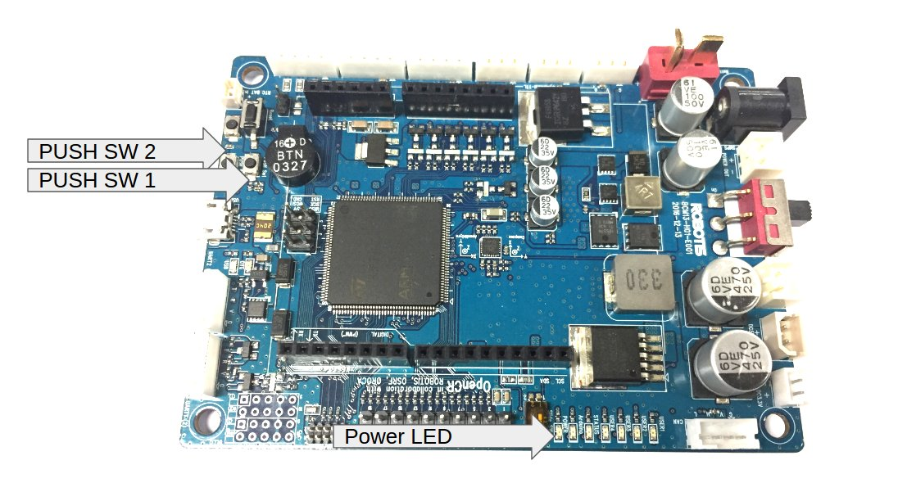

Hardware Setup
==============

.. image:: _static/hardware/turtlebot3_models_rd2.png

Main Components
---------------

.. image:: _static/hardware/turtlebot3_main_components_burger.png

.. image:: _static/hardware/turtlebot3_main_components_waffle.png

Part List
---------

The TurtleBot3 has two different models: the ``Burger`` and the ``Waffle``. The following list shows their components. The big differences between two models are the Motor, the SBC(Single Board Computer) and the Sensors.

+---------------+--------------------------------+--------+---------+
| The number of the parts of each model          | Burger | Waffle  |
+===============+================================+========+=========+
|               | Waffle-Plate                   | 8      | 24      |
+               +--------------------------------+--------+---------+
|               | Plate Support M3x35mm          | 4      | 12      |
+               +--------------------------------+--------+---------+
|               | Plate Support M3x45mm          | 10     | 10      |
+               +--------------------------------+--------+---------+
| Chasis        | PCB Support                    | 12     | 12      |
+               +--------------------------------+--------+---------+
|               | Wheel                          | 2      | 2       |
+               +--------------------------------+--------+---------+
|               | Tire                           | 2      | 2       |
+               +--------------------------------+--------+---------+
|               | Ball Caster                    | 1      | 2       |
+---------------+--------------------------------+--------+---------+
|               | DYNAMIXEL (XL430)              | 2      | 0       |
+ Motor         +--------------------------------+--------+---------+
|               | DYNAMIXEL (XM430)              | 0      | 2       |
+---------------+--------------------------------+--------+---------+
|               | OpenCR                         | 1      | 1       |
+               +--------------------------------+--------+---------+
|               | Raspberry Pi 3                 | 1      | 0       |
+ Board         +--------------------------------+--------+---------+
|               | Intel® Joule™                  | 0      | 1       |
+               +--------------------------------+--------+---------+
|               | USB2LDS                        | 1      | 1       |
+---------------+--------------------------------+--------+---------+
|               | HLS-LFCD2                      | 1      | 1       |
+ Sensor        +--------------------------------+--------+---------+
|               | Intel® Realsense™ R200         | 0      | 1       |
+---------------+--------------------------------+--------+---------+
| Memory        | MicroSD Card                   | 1      | 0       |
+---------------+--------------------------------+--------+---------+
|               | Raspberry Pi 3 Power Cable     | 1      | 0       |
+               +--------------------------------+--------+---------+
|               | Intel® Joule™ Power Cable      | 0      | 1       |
+               +--------------------------------+--------+---------+
| Cable         | Li-Po Battery Extension Cable  | 1      | 1       |
+               +--------------------------------+--------+---------+
|               | DYNAMIXEL to OpenCR Cable      | 2      | 2       |
+               +--------------------------------+--------+---------+
|               | USB Cable                      | 2      | 2       |
+---------------+--------------------------------+--------+---------+
|               | SMPS 12V5A                     | 1      | 1       |
+               +--------------------------------+--------+---------+
| Power         | A/C Code                       | 1      | 1       |
+               +--------------------------------+--------+---------+
|               | LIPO Battery 11.1V 1800mAh     | 1      | 1       |
+---------------+--------------------------------+--------+---------+
|               | Screw driver                   | 1      | 1       |
+               +--------------------------------+--------+---------+
|               | Rivet tool                     | 1      | 1       |
+ Tool          +--------------------------------+--------+---------+
|               | USB3.0 HUB                     | 0      | 1       |
+               +--------------------------------+--------+---------+
|               | LIPO Battery charger           | 1      | 1       |
+---------------+--------------------------------+--------+---------+
|               | PH_M2x4mm_K                    | 8      | 8       |
+               +--------------------------------+--------+---------+
|               | PH_T2x6mm_K                    | 4      | 8       |
+               +--------------------------------+--------+---------+
|               | PH_M2x12mm_K                   | 0      | 4       |
+               +--------------------------------+--------+---------+
|               | PH_M2.5x8mm_K                  | 16     | 12      |
+               +--------------------------------+--------+---------+
|               | PH_M2.5x12mm_K                 | 0      | 18      |
+               +--------------------------------+--------+---------+
|               | PH_T2.6x12mm_K                 | 16     | 0       |
+               +--------------------------------+--------+---------+
|               | PH_M2.5x16mm_K                 | 4      | 4       |
+ Part          +--------------------------------+--------+---------+
|               | PH_M3x8mm_K                    | 44     | 140     |
+               +--------------------------------+--------+---------+
|               | NUT_M2                         | 0      | 4       |
+               +--------------------------------+--------+---------+
|               | NUT_M2.5                       | 20     | 18      |
+               +--------------------------------+--------+---------+
|               | NUT_M3                         | 16     | 96      |
+               +--------------------------------+--------+---------+
|               | Rivet_1                        | 14     | 20      |
+               +--------------------------------+--------+---------+
|               | Spacer                         | 4      | 4       |
+               +--------------------------------+--------+---------+
|               | Bracket                        | 5      | 8       |
+               +--------------------------------+--------+---------+
|               | Adapter Plate                  | 1      | 1       |
+               +--------------------------------+--------+---------+
|               | Rivet_2                        | 2      | 2       |
+---------------+--------------------------------+--------+---------+

Assembly Manual
---------------

Every TurtleBots come unassembled in boxes. Follow the instructions to assemble the TurtleBot3.

Burger Model
~~~~~~~~~~~~

:download: `Assembly manual for TurtleBot3 Burger`_

Waffle Model
~~~~~~~~~~~~

:download: `Assembly manual for TurtleBot3 Waffle`_

Assembly Video
--------------

If it is difficult to assemble only the assembly manual, please refer to the following video.

Burger Model
~~~~~~~~~~~~

.. raw:: html

  <iframe width="640" height="360" src="https://www.youtube.com/embed/rvm-m2ogrLA" frameborder="0" allowfullscreen></iframe>

|

Waffle Model
~~~~~~~~~~~~

.. raw:: html

  <iframe width="640" height="360" src="https://www.youtube.com/embed/1nTMyr4ybi0" frameborder="0" allowfullscreen></iframe>

|

Basic Operations
--------------------

You can use the ``PUSH SW 1`` and ``PUSH SW 2`` buttons to see whether your robot has been properly assembled. This process tests the left and right Dynamixel and the OpenCR board.

1. After assembling, connect the battery to the OpenCR board and turn on the power switch. You can see that the ``Power LED`` of OpenCR turns on.
2. Place the robot on the floor. At this time, the safety distance should be 1 meter on each side.
3. Press the ``PUSH SW 1`` to confirm that the robot moves 30 centimeters forward.
#. Press the ``PUSH SW 2`` to confirm that the robot rotates 180 degrees in place.

Open Source Hardware
--------------------

The components of Turtlebot3 as a default are the following: the Chassis, the Motors, the Wheels, the OpenCR board, the Computer, the Sensor, the Battery. The chassis are the Waffle plates, the Board support, the Ball caster, etc. The big feature of the chassis is in the Waffle plate, which is the biggest in all TurtleBot3 parts, but is smaller than the hand. This plate will be provided as an injection molded, and it achieves the low cost, but the CAD data for 3D printing is also available. The Turtlebot3 Burger is a Two-wheeled differential drive type platform, but is able to be structurally and mechanically customized in many ways: the Cars, the Bikes, the Trailers and so on.

The CAD data is released to the Onshape, which is a full-cloud 3D CAD editor. Get access through a web browser by using the computer or even by the portable devices. Here allows the works of drawing, assemblying with the co-workers.

- TurtleBot3 Burger Model: https://goo.gl/n3bGNr
- TurtleBot3 Waffle Model: https://goo.gl/wCDvVI

.. _Assembly manual for TurtleBot3 Burger: https://drive.google.com/file/d/0B5tlMnyFIdLYWDRfRjRLUHduRDA/view?usp=sharing
.. _Assembly manual for TurtleBot3 Waffle: https://drive.google.com/file/d/0B5tlMnyFIdLYd3VHRDBKM2xsY2M/view?usp=sharing
