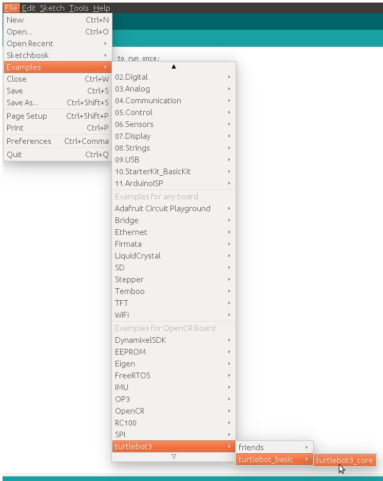
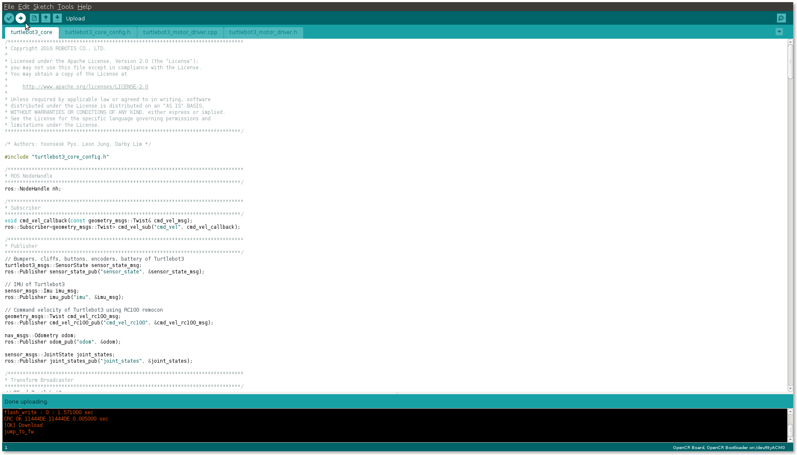

OpenCR Software Setup
=====================

.. NOTE:: This instruction was tested on ``Ubuntu 16.04.1`` and ``ROS Kinetic Kame`` version.

The OpenCR controls the Dynamixels on the instructions from the SBC. To do this, a specific firmware should be built in the board. See the descriptions and configure the settings.

ArduinoIDE settings for the OpenCR
----------------------------------

Follow the instructions to get the OpenCR Arduino development environment on the remote PC.

USB port settings
~~~~~~~~~~~~~~~~~

Make the OpenCR USB port be able to upload the ``Arduino IDE`` program without root permission.

.. code-block:: bash

  wget https://raw.githubusercontent.com/ROBOTIS-GIT/OpenCR/master/99-opencr-cdc.rules
  sudo cp ./99-opencr-cdc.rules /etc/udev/rules.d/
  sudo udevadm control --reload-rules

Compiler Settings
~~~~~~~~~~~~~~~~~

Since the OpenCR libraries is built for 32 bit platform, 64 bit PC needs the 32 bit compiler relevants for the ArduinoIDE.

.. code-block:: bash

  sudo apt-get install libncurses5-dev:i386

Install the Arduino IDE
~~~~~~~~~~~~~~~~~~~~~~~

Download the latest version of ``Arduino IDE`` from the official arduino homepage, and install it. Currently, the OpenCR will be on service in the version ``1.16.0`` or later.

https://www.arduino.cc/en/Main/Software

Then, extract the downloaded file to the desired folder and execute the installation file from the terminal. In this case, the example shown below makes the folder *tools* in the user's top folder (``~/``). This folder will act as the Arduino IDE folder.

.. code-block:: bash

  cd ~/tools/arduino-1.16.0
  ./install.sh

Set the file path of installed ``Arduino IDE`` as an absolute path named ``PATH`` in the ``bashrc`` file. Here recommends to use **gedit editor**. (Use another editor, if necessary.) Finally, `source` it to apply the changes.

.. code-block:: bash

  gedit ~/.bashrc
  export PATH=$PATH:$HOME/tools/arduino-1.16.0
  source ~/.bashrc

Run the Arduino IDE
~~~~~~~~~~~~~~~~~~~

To run the ``Arduino IDE`` on Linux platform, type into the terminal as follows.

.. code-block:: bash

  arduino

.. image:: _static/preparation/ide0.png

Porting the OpenCR board to the Arduino IDE
~~~~~~~~~~~~~~~~~~~~~~~~~~~~~~~~~~~~~~~~~~~

Preferences
...........

After ``Arduino IDE`` is run, click ``File`` → ``Preferences`` in the top menu of the IDE. When the *Preferences* window appears, copy and paste following link to the ``Additional Boards Manager URLs`` textbox. (This step may take about 20 min.)

.. code-block:: bash

  https://raw.githubusercontent.com/ROBOTIS-GIT/OpenCR/master/arduino/opencr_release/package_opencr_index.json

.. image:: _static/preparation/ide1.png

Install the OpenCR package via Boards Manager
.............................................

Click ``Tools`` → ``Board`` → ``Boards Manager``.

.. image:: _static/preparation/ide2.png

Type `OpenCR` into the textbox to find the ``OpenCR by ROBOTIS`` package. After it finds out, click ``Install``.

.. image:: _static/preparation/ide3.png

After the installation, "INSTALLED" will be appeared.

.. image:: _static/preparation/ide4.png

See if ``OpenCR Board`` is now on the list of ``Tools`` → ``Board``. Click this to import the OpenCR Board source.

.. image:: _static/preparation/ide5.png

Port setting
............

This step shows the port setting for the program uploads. The OpenCR should be connected to the PC and the OpenCR via the USB ports.
 
Select ``Tools`` → ``Port`` → ``/dev/ttyACM0``.

.. WARNING:: The value of ``/dev/ttyACM0`` may be different depending on the environment connected to the PC.

.. image:: _static/preparation/ide6.png

(TODO : the programmer in the picture should be changed into not the AVRISP mkll)

Modemmanager removal
~~~~~~~~~~~~~~~~~~~

After programming with the Arduino IDE and uploading the program to the OpenCR, the OpenCR will be restarted and be reconnected. At the same moment, the modem-related packages of the Linux will send the AT command to manage the device. Thus indicates an connection error on the OpenCR, so this step should be done previously.

.. code-block:: bash

  sudo apt-get purge modemmanager

Bootloader writing
~~~~~~~~~~~~~~~~~~

The STM32F7xx, which is used for the main MCU on the OpenCR board, supports DFU(Device Firmware Upgrade). This enables the built-in bootloader of the MCU by itself to boot the DFU protocol by using USB, primarily for the bootloader initialization, the recovery mode, and the bootloader update. The biggest advantage to let the users be able to use bootloader with USB but no other JTAG equipment. Write the firmware by using the DFU mode which is embedded in MCU without writing / debugging equipment, such as STLink.

Programmer Setting
..................

Select ``Tools`` → ``DFU-UTIL``

.. image:: _static/preparation/ide7.png

Run DFU mode.
............

Press the ``Reset`` button while the ``Boot`` button is being pushed. This activates the DFU mode.

.. image:: _static/preparation/ide8.png

Download the bootloader.
......................

Click ``Tools`` → ``Burn Bootloader`` to download the bootloader.

.. image:: _static/preparation/ide9.png

OpenCR Firmware settings for ROS
------

Add the TurtleBot3 firmware into the OpenCR.
~~~~~~~~~~~~~~~~~~~~~~~~~~~~~~~~~~~~~~~

The OpenCR firmware (or the source) for ROS is to control the Dynamixel and the sensors in the ROS. The firmware is located in the OpenCR example, which is downloaded also by the board manager.

Click ``File`` → ``Examples`` → ``turtlebot3`` → ``turtlebot_burger`` → ``turtlebot3_core``.

If your robot is TurtleBot3 WAFFLE,

Click ``File`` → ``Examples`` → ``turtlebot3`` → ``turtlebot_waffle`` → ``turtlebot3_core``.

Click ``Upload`` to get the firmware into the OpenCR.

.. image:: _static/opencr/o2.png

.. NOTE ::

  Check again if the port is set properly by seeing ``Tools`` → ``Port``.

When it completes the upload, the text `Download completed` will be shown.

[Manual] Update the TurtleBot3 software to the ArduinoIDE
~~~~~~~~~~~~~~~~~~~~~~~~~~~~~~~~~~~~~~~

(TODO)

OpenCR Library (Linux platform)

.. code-block:: bash

  /home/(user name)/.arduino15

.. _ROS: http://wiki.ros.org
