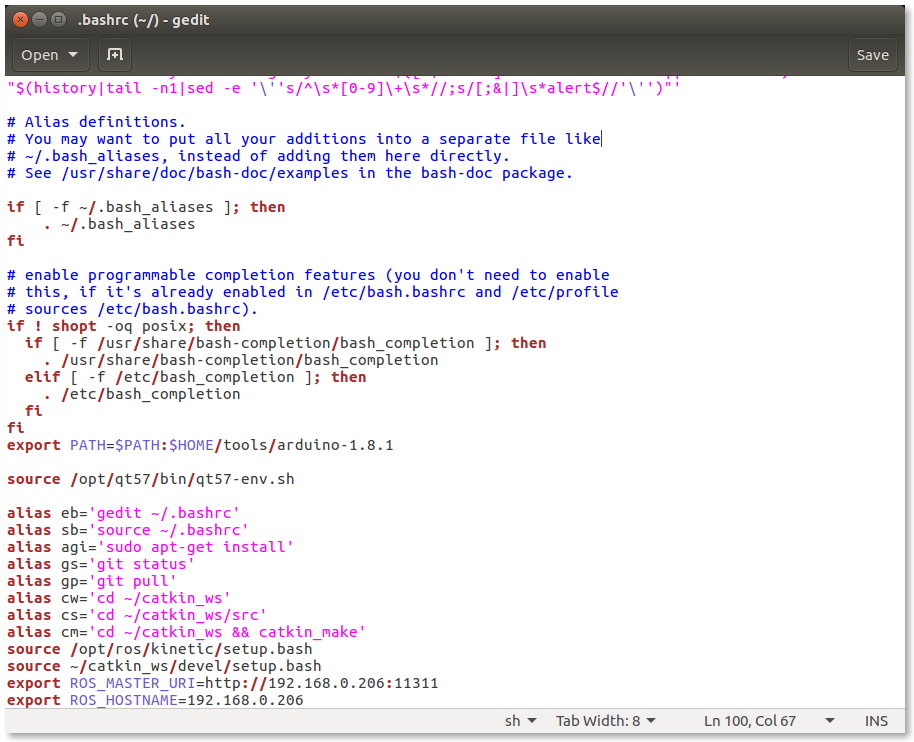

PC Software Setup
=================

.. image:: _static/software/remote_pc_and_turtlebot.png
    :align: center

.. WARNING:: The following contents correspond to ``Remote PC`` (your desktop or laptop PC) which controls TurtleBot3. You should never apply the following to your TurtleBot.

.. NOTE:: This instruction was tested on ``Ubuntu 16.04`` and ``ROS Kinetic Kame`` version.

Install Ubuntu in the remote PC (Desktop or Laptop PC)
-----------------------------------------------------------

[``Remote PC``] Download the ``Ubuntu 16.04`` version on the remote PC from the following link.

- https://www.ubuntu.com/download/desktop

If it needs some help to install Ubuntu, check out the step-by-step guide.

- https://www.ubuntu.com/download/desktop/install-ubuntu-desktop

Install ROS in the remote PC
--------------------------------

.. image:: _static/logo_ros.png
    :align: center
    :target: http://wiki.ros.org

[``Remote PC``] There are two ways to install `ROS`_. If you prefer manual installation, please take the second method. 

**First Method** : Install the `ROS`_ by using a simple installation script file

.. TIP:: The terminal application can be searched with the Ubuntu search icon on top left corner of screen. Shortcut key for terminal is Ctrl-Alt-T.

.. code-block:: bash

  sudo apt-get update
  sudo apt-get upgrade
  wget https://raw.githubusercontent.com/ROBOTIS-GIT/robotis_tools/master/install_ros_kinetic.sh && chmod 755 ./install_ros_kinetic.sh && bash ./install_ros_kinetic.sh

**Second Method** : You can start from "`1.2 Setup your sources.list`_" and keep working on until "`1.7 Getting rosinstall`_" from below ROS installation instruction link.  

- http://wiki.ros.org/kinetic/Installation/Ubuntu

.. NOTE:: In order to check which packages are installed, Please follow this link. https://raw.githubusercontent.com/oroca/oroca-ros-pkg/kinetic/ros_install.sh

If you are going to modify or develop source code from the remote PC, you'll have to configure ROS environment. Steps described in the below link are farily simple and take a couple minutes.

- http://wiki.ros.org/ROS/Tutorials/InstallingandConfiguringROSEnvironment

Install dependent packages
------------------------------

[``Remote PC``] The next step is to install dependent packages for the TurtleBot3 control.

.. code-block:: bash

  sudo apt-get install ros-kinetic-joy ros-kinetic-teleop-twist-joy ros-kinetic-teleop-twist-keyboard ros-kinetic-laser-proc ros-kinetic-rgbd-launch ros-kinetic-depthimage-to-laserscan ros-kinetic-rosserial-arduino ros-kinetic-rosserial-python ros-kinetic-rosserial-server ros-kinetic-rosserial-client ros-kinetic-rosserial-msgs ros-kinetic-amcl ros-kinetic-map-server ros-kinetic-move-base ros-kinetic-urdf ros-kinetic-xacro ros-kinetic-gmapping ros-kinetic-navigation

.. code-block:: bash

  cd ~/catkin_ws/src/
  git clone https://github.com/ROBOTIS-GIT/turtlebot3_msgs.git
  git clone https://github.com/ROBOTIS-GIT/turtlebot3.git
  cd ~/catkin_ws && catkin_make

If catkin_make is completed without any errors, the preparation for using TurtleBot3 will be finished.

Network Configuration
---------------------

.. image:: _static/software/network_configuration.png

ROS needs IP addresses to communicate between the TurtleBot and the remote PC.

[``Remote PC``] Type the next to find out IP address of the remote PC.

.. code-block:: bash

  ifconfig

Rectangled text is the IP address of the ``Remote PC``.

[``Remote PC``] Do the following.

.. code-block:: bash

  gedit ~/.bashrc

Change the `localhost` into the IP address shown as follows.

.. image:: _static/software/network_configuration2.png

[``Remote PC``] Then, source the bashrc

.. code-block:: bash

  source ~/.bashrc

.. _1.2 Setup your sources.list: http://wiki.ros.org/kinetic/Installation/Ubuntu#Installation.2BAC8-Ubuntu.2BAC8-Sources.Setup_your_sources.list
.. _1.7 Getting rosinstall: http://wiki.ros.org/kinetic/Installation/Ubuntu#Getting_rosinstall
.. _ROS: http://wiki.ros.org
