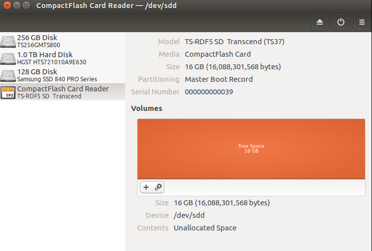
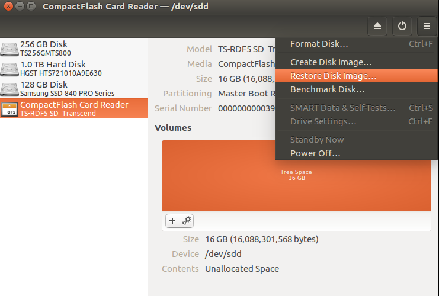
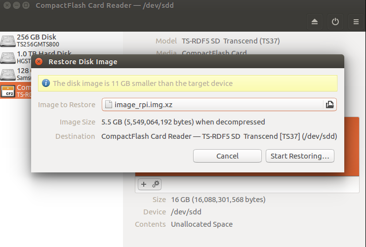
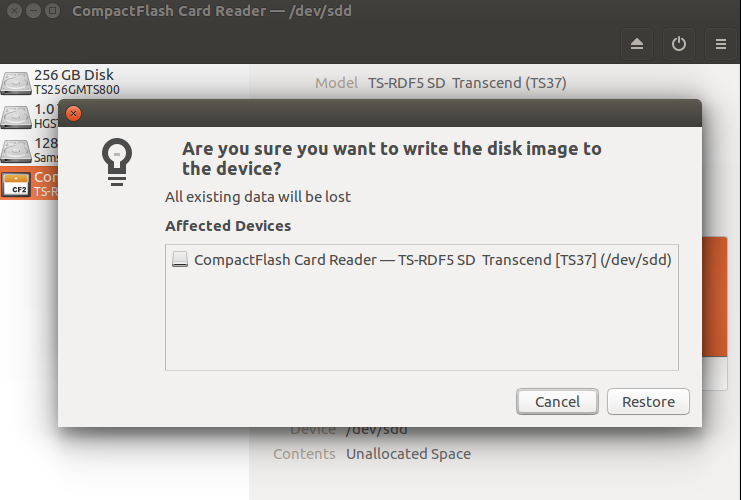
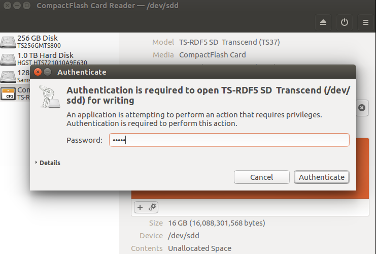
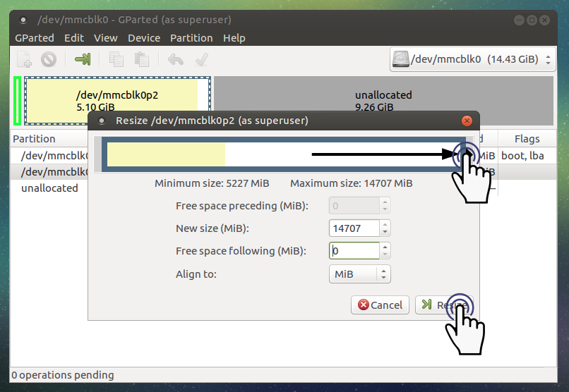

SBC Software Setup
==================

.. NOTE:: This instruction was tested on ``Ubuntu 16.04.1`` and ``ROS Kinetic Kame`` version.

Install the Ubuntu MATE in the Raspberry Pi 3 (TurtleBot3 Basic)
----------------------------------------------------------------

.. WARNING:: Following steps need a SDcard reader to install the TurtleBot3 Basic image.

.. WARNING:: The SDcard should have its capacity more than **8 GB** for the installation of the TurtleBot3 Basic image.

Download the disk image file for Raspberry Pi 3 from the following link. The disk image file contains ``Ubuntu MATE 16.04.1`` and ``ROS kinetic kame``, and all ROS packages which are needed for TurtleBot3 Basic.

- https://goo.gl/rdum6W

To image a bootable microSDHC, follow the instructions as shown below. Here recommends to use **GNOME Disks**.

Run **GNOME Disks** through the terminal.

.. code-block:: bash

  gnome-disks

Choose the disk for imaging, then click ``Restore Disk Image…`` option, which supports XZ compressed disk image natively.

Select the image file which is wanted to be imaged on to the disk, then click ``Start Restoring...``.

Click ``Restore`` to continue.

Type the password of the PC, then click ``Authenticate``. (This step may take about 15 min.)

Check whether the image is burned to the disk.

.. image:: _static/software/rpi_disk6.png
   :width: 400px

Now, insert the microSD card into your Raspberry Pi 3 and turn on the power. Then, connect the Raspberry Pi to the monitor with an HDMI cable and connect a USB or wireless input devices.

.. NOTE:: The HDMI cable should be connected to the Raspberry Pi 3 before booting.

Initialized user ID and password are ``turtlebot``. The user ID and the password is configurable after login.

.. image:: _static/software/login.png
   :width: 600px

The Ubuntu Mate image get from previous steps was shrinked of its own size to mimimum so that the image can be adapted to a small-capacity SD card.

To use the full space that the SD card has, on the other hand, the image on the SD card should be resized again. Here recommends **GParted** to resize the SD card. The following instructions describes how to resize **16 GB** SD card after imaging.

Run **GParted**.

.. code-block:: bash

  sudo gparted

Choose a installed TurtleBot3 image, and then click ``Resize``.

.. image:: _static/software/resize01.png
   :width: 600px

Set the size to be used.

.. image:: _static/software/resize02.png
   :width: 600px

Click ``Resize``.

Click ``Apply All Operations``.

.. image:: _static/software/resize04.png
   :width: 600px

Click ``Apply``.

.. image:: _static/software/resize05.png
   :width: 600px

Click ``Close``

.. image:: _static/software/resize06.png
   :width: 600px

When the settings are finished, go to the next step.

Install the Ubuntu in the Intel® Joule™ (TurtleBot3 Premium)
------------------------------------------------------------

Please refer to the manual installation below.

Network Configuration
---------------------

.. image:: _static/software/network_configuration.png

Manual setting (Ubuntu and ROS)
-------------------------------

.. NOTE:: Skip this step when the downloaded image is being used (Manual Installation).

[Manual] Install the Ubuntu MATE for the Raspberry Pi 3 (TurtleBot3 Basic Model)
~~~~~~~~~~~~~~~~~~~~~~~~~~~~~~~~~~~~~~~~~~~~~~~~~~~~~~~~~~~~~~~~~~~~~~~~~~~~~~~~

Download the ``Ubuntu MATE 16.04.1`` version on the Raspberry Pi 3 from the link.

- https://ubuntu-mate.org/download/

.. image:: _static/preparation/download_ubuntu_mate_image.png

To install Ubuntu MATE by using the image file, please refer to the link shown below.

- https://ubuntu-mate.org/raspberry-pi/

[Manual] Install TurtleBot3 dependent ROS packages for the Raspberry Pi 3
~~~~~~~~~~~~~~~~~~~~~~~~~~~~~~~~~~~~~~~~~~~~~~~~~~~~~~~~~~~~~~~~~~~~~~~~~~~~~~~~

Download the packages by typing as follows.

.. code-block:: bash

  sudo apt-get install ros-kinetic-amcl ros-kinetic-rosserial ros-kinetic-map-server ros-kinetic-move-base 

[Manual] Install the Ubuntu for the Intel® Joule™ (TurtleBot3 Premium Model)
~~~~~~~~~~~~~~~~~~~~~~~~~~~~~~~~~~~~~~~~~~~~~~~~~~~~~~~~~~~~~~~~~~~~~~~~~~~~

Download the image ``Ubuntu 16.04`` version in the Intel® Joule™ from the link.

- https://developer.ubuntu.com/core/get-started/intel-joule#alternative-install:-ubuntu-desktop-16.04-lts

Make a bootable USB drive to install Ubuntu.

- https://software.intel.com/en-us/node/705675#ubuntu

If necessary, see the other information in the link.

- https://software.intel.com/en-us/node/700692

[Manual] Install the ROS and packages
~~~~~~~~~~~~~~~~~~~~~~~~~~~~~~~~~~~~~

.. image:: _static/logo_ros.png
    :align: center
    :target: http://wiki.ros.org

Install the `ROS`_ by using a simple installation script file.

.. code-block:: bash

  wget https://raw.githubusercontent.com/oroca/oroca-ros-pkg/kinetic/ros_install.sh && chmod 755 ./ros_install.sh && bash ./ros_install.sh catkin_ws kinetic

or follow the typical instruction in the link.

- http://wiki.ros.org/kinetic/Installation/Ubuntu

The next step is to install the dependent packages for the TurtleBot3 control.

.. code-block:: bash

  sudo apt-get install ros-kinetic-joy ros-kinetic-teleop-twist-joy ros-kinetic-teleop-twist-keyboard ros-kinetic-laser-proc ros-kinetic-rgbd-launch ros-kinetic-depthimage-to-laserscan ros-kinetic-rosserial-arduino ros-kinetic-rosserial-python ros-kinetic-rosserial-server ros-kinetic-rosserial-client ros-kinetic-rosserial-msgs ros-kinetic-amcl ros-kinetic-map-server ros-kinetic-move-base ros-kinetic-hls-lfcd-lds-driver ros-kinetic-urdf ros-kinetic-xacro ros-kinetic-turtlebot-teleop

.. code-block:: bash

  git clone https://github.com/ROBOTIS-GIT/turtlebot3.git
  cd ~/catkin_ws && catkin_make

If catkin_make is completed without any errors, the preparation for using TurtleBot3 will be finished.

[Manual] USB settings
~~~~~~~~~~~~~~~~~~~~~

The following allows the USB port to be used for the OpenCR board without root privileges.

.. code-block:: bash

  wget https://raw.githubusercontent.com/ROBOTIS-GIT/OpenCR/master/99-opencr-cdc.rules
  sudo cp ./99-opencr-cdc.rules /etc/udev/rules.d/
  sudo udevadm control --reload-rules

.. _ROS: http://wiki.ros.org
