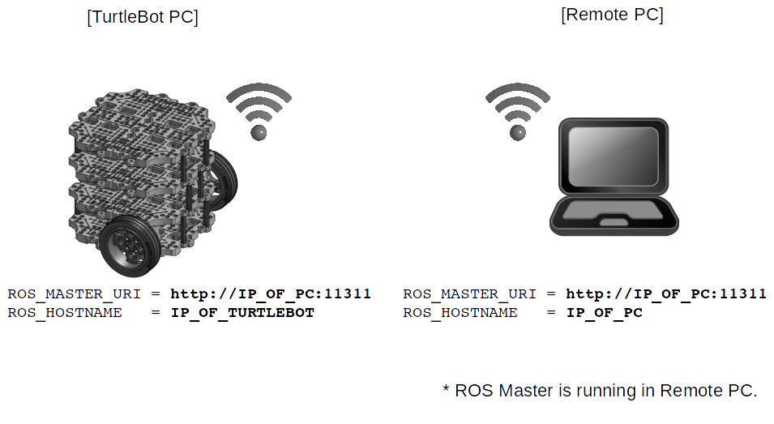

SBC Software Setup
==================

.. image:: _static/software/remote_pc_and_turtlebot.png
    :align: center

.. NOTE:: A ``SBC(Single-Board Computer)`` is a complete computer built on a single circuit board, with microprocessor(s), memory, input/output (I/O) and other features required of a functional computer. The TurtleBot3 uses Raspberry Pi (TB3 Burger) and Intel® Joule™ (TB3 Waffle) as SBC.

.. NOTE:: This instruction was tested on ``Ubuntu 16.04`` and ``ROS Kinetic Kame`` version.

Install the Linux for TurtleBot3 Burger (Raspberry Pi 3)
---------------------------------------------------------

.. WARNING:: The SDcard should have its capacity more than **8 GB** for the installation of the TurtleBot3.

[``Remote PC``] Download the ``Ubuntu MATE 16.04`` version on the Raspberry Pi 3 from the link below.

- https://ubuntu-mate.org/download/

[``Remote PC``] To install Ubuntu MATE by using the image file, we recommend using GNOME Disks and the ``Restore Disk Image…`` option, which natively supports XZ compressed images.

.. code-block:: bash

  sudo apt-get install gnome-disk-utility

.. raw:: html

  <iframe width="640" height="360" src="https://www.youtube.com/embed/V_6GNyL6Dac?ecver=1" frameborder="0" allowfullscreen></iframe>

|

.. TIP:: We recommend using ``GNOME Disks``, but we can use other methods using ``ddrescue`` on Linux

  .. code-block:: bash

    sudo apt-get install gddrescue xz-utils
    unxz ubuntu-mate-16.04.2-desktop-armhf-raspberry-pi.img.xz
    sudo ddrescue -D --force ubuntu-mate-16.04.2-desktop-armhf-raspberry-pi.img /dev/sdx

.. TIP:: We recommend using ``GNOME Disks``, but we can use other methods using ``Win32 Disk Imager`` on Windows

  https://sourceforge.net/projects/win32diskimager/

Install the Linux for TurtleBot3 Waffle (Intel® Joule™)
-------------------------------------------------------

What will be installed is an Alternative Ubuntu Desktop 16.04 LTS image by following the instructions.

[``Remote PC``] Download the image ``Alternative Ubuntu 16.04 for Intel® Joule™`` from the link.

- http://people.canonical.com/~platform/snappy/tuchuck/desktop-beta4/tuchuck-xenial-desktop-iso-20170109-0.iso

[``Remote PC``] To make a bootable USB drive to install Ubuntu, follow the steps shown in linked page.

- https://developer.ubuntu.com/core/get-started/installation-medias

[``Remote PC``] Before Ubuntu installation, Joule needs BIOS upgrade to get Ubuntu Image. Download firmware which contains  Joule's new BIOS and flash the BIOS into the Joule by following instructions linked below.

- https://software.intel.com/en-us/flashing-the-bios-on-joule

.. WARNING:: ``Intel® Joule™`` has its ``passive heatsink`` in its product. It recommends to use the heatsink. To use the Joule while the heatsink is not used, follow the extra instruction: https://software.intel.com/en-us/node/721471

[``Intel® Joule™``] Put a ``micro HDMI to HDMI cable``, a ``power connector supplied by OpenCR``, some ``USB devices`` including a ``Bootable USB drive``, ``mouse`` and ``keyboard``. 

[``Intel® Joule™``] Monitor will show a series of installation screens as following walkthroughs. When it powers on, monitor will blink about 3 times after 5 seconds, and shows some options. Press ``f7`` to go to ``boot manager``

.. image:: _static/preparation/j1.JPG

[``Intel® Joule™``] Select ``USB disk``.

.. image:: _static/preparation/j2.JPG

.. image:: _static/preparation/j3.JPG

.. image:: _static/preparation/j4.JPG

.. image:: _static/preparation/j5.JPG

[``Intel® Joule™``] Select ``Erase drive and install Ubuntu`` then ``continue``.

.. image:: _static/preparation/j6.JPG

[``Intel® Joule™``] Every ``Intel® Joule™`` has two different disk drive: 16GB micro SD Card and 16GB eMMC. This description suggest to install the ``Alternarive Ubuntu for Joule`` into the ``16GB eMMC``. Select ``MMC/SD card #2 (mmcblk1) - 15.7 GB MMC 016G32`` then ``continue``.

.. image:: _static/preparation/j7.JPG

.. image:: _static/preparation/j8.JPG

[``Intel® Joule™``] The installation will take 10 or more minutes.

.. image:: _static/preparation/j9.JPG

[``Intel® Joule™``] After the installation, click ``Restart Now``.

.. image:: _static/preparation/j10.JPG

[``Intel® Joule™``] Remove bootable USB drive.

.. image:: _static/preparation/j11.JPG

[``Intel® Joule™``] Don't press any key. It will boot with ``16GB eMMC`` as a default boot device.

.. image:: _static/preparation/j12.JPG

.. image:: _static/preparation/j13.JPG

.. image:: _static/preparation/j14.JPG

[``Intel® Joule™``] Finish the rest of settings.

.. image:: _static/preparation/j15.JPG

.. image:: _static/preparation/j16.JPG

.. image:: _static/preparation/j17.JPG

.. image:: _static/preparation/j18.JPG

.. image:: _static/preparation/j19.JPG

.. image:: _static/preparation/j20.JPG

.. image:: _static/preparation/j21.JPG

Install the ROS and packages (Burger and Waffle)
------------------------------------------------

.. WARNING:: The following contents correspond to ``TurtleBot``'s SBC (your Raspberry Pi or Intel® Joule™) which TurtleBot's main computer. You should never apply the following to your Remote PC (your desktop or laptop PC).

.. NOTE:: It takes about 2 hours to install the following ROS and TurtleBot3 related packages. This depends on your network environment.

.. image:: _static/logo_ros.png
    :align: center
    :target: http://wiki.ros.org

[``TurtleBot``] Install the `ROS`_ by using a simple installation script file.

.. TIP:: Terminal is opened to go to the Ubuntu search icon, type "Terminal" or use Ctrl-Alt-T.

.. code-block:: bash

  wget https://raw.githubusercontent.com/oroca/oroca-ros-pkg/kinetic/ros_install.sh && chmod 755 ./ros_install.sh && bash ./ros_install.sh catkin_ws kinetic

or follow the typical instruction in the link.

- http://wiki.ros.org/kinetic/Installation/Ubuntu

.. NOTE:: Someone who want to show which packages are installed, Please following this link. https://raw.githubusercontent.com/oroca/oroca-ros-pkg/kinetic/ros_install.sh

[``TurtleBot``] The next step is to install the dependent packages for the TurtleBot3 control.

.. code-block:: bash

  sudo apt-get install ros-kinetic-joy ros-kinetic-teleop-twist-joy ros-kinetic-teleop-twist-keyboard ros-kinetic-laser-proc ros-kinetic-rgbd-launch ros-kinetic-depthimage-to-laserscan ros-kinetic-rosserial-arduino ros-kinetic-rosserial-python ros-kinetic-rosserial-server ros-kinetic-rosserial-client ros-kinetic-rosserial-msgs ros-kinetic-amcl ros-kinetic-map-server ros-kinetic-move-base ros-kinetic-urdf ros-kinetic-xacro ros-kinetic-turtlebot-teleop ros-kinetic-compressed-image-transport ros-kinetic-rqt-image-view

.. code-block:: bash

  cd ~/catkin_ws/src
  git clone https://github.com/ROBOTIS-GIT/hls_lfcd_lds_driver.git
  git clone https://github.com/ROBOTIS-GIT/turtlebot3_msgs.git
  git clone https://github.com/ROBOTIS-GIT/turtlebot3.git
  cd ~/catkin_ws && catkin_make

If catkin_make is completed without any errors, the preparation for using TurtleBot3 will be finished.

USB settings (Burger and Waffle)
--------------------------------

[``TurtleBot``] The following allows the USB port to be used for the OpenCR board without root privileges.

.. code-block:: bash

  wget https://raw.githubusercontent.com/ROBOTIS-GIT/turtlebot3/master/99-turtlebot3-cdc.rules
  sudo cp ./99-turtlebot3-cdc.rules /etc/udev/rules.d/
  sudo udevadm control --reload-rules
  sudo udevadm trigger

Network Configuration (Burger and Waffle)
-----------------------------------------

ROS needs IP addresses to communicate between the TurtleBot and the remote PC.

[``TurtleBot``] Type the next to find out the IP address of your TurtleBot.

.. code-block:: bash

  ifconfig

Rectangled text is the IP address of the ``TurtleBot``.

[``TurtleBot``] Do the following.

.. code-block:: bash

  pluma ~/.bashrc

[``TurtleBot``] Change the `localhost` into the IP address shown as follows.

.. image:: _static/software/network_configuration4.png

[``TurtleBot``] Then, source the bashrc

.. code-block:: bash

  source ~/.bashrc

.. image:: _static/software/network_configuration5.png

.. _ROS: http://wiki.ros.org
