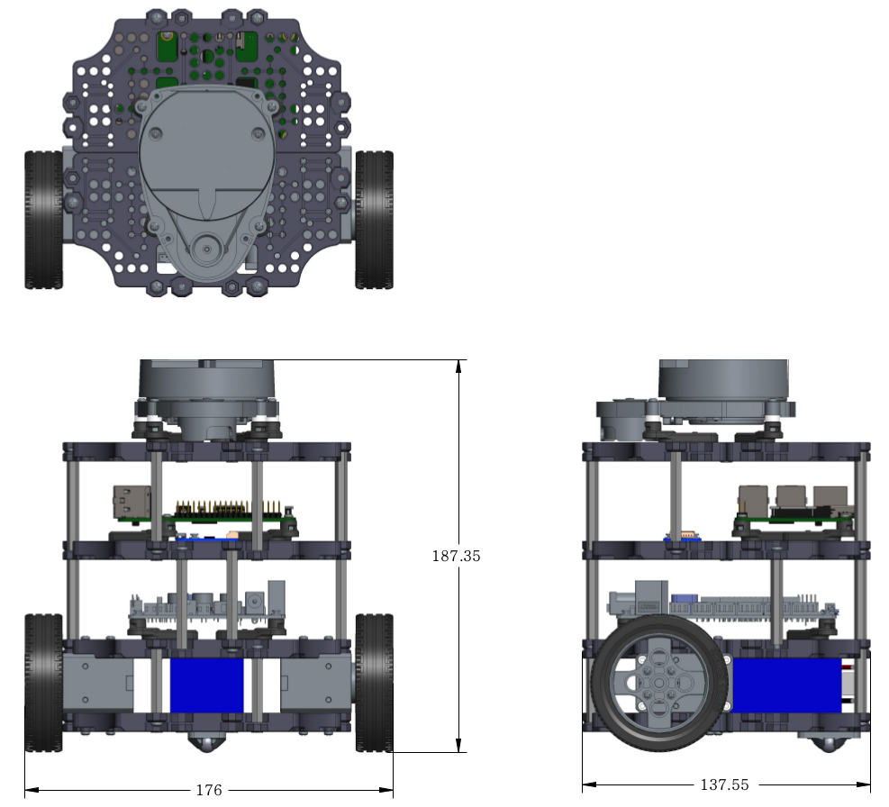
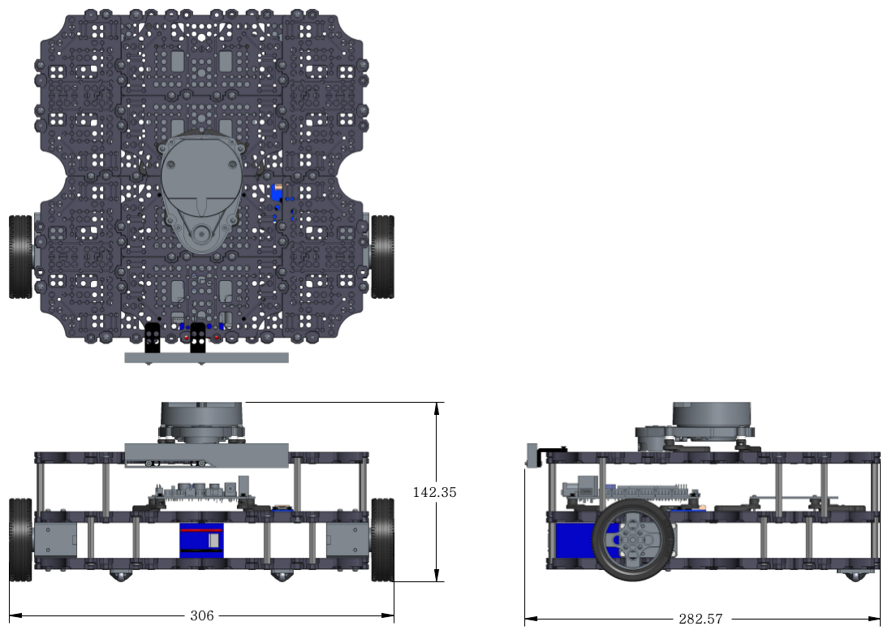

Specifications
==============

.. image:: _static/hardware/turtlebot3_models.png

TurtleBot3
----------

+------------------------------------+---------------------------+---------------------------+
| Items                              | Basic                     | Premium                   |
+====================================+===========================+===========================+
| Maximum translational velocity     | 0.22 m/s                  | 0.26 m/s                  |
+------------------------------------+---------------------------+---------------------------+
| Maximum rotational velocity        | 2.84 rad/s (162.72 deg/s) | 1.82 rad/s (104.27 deg/s) |
+------------------------------------+---------------------------+---------------------------+
| Maximum payload                    | 30kg                      | 60kg                      |
+------------------------------------+---------------------------+---------------------------+
| Size (L x W x H)                   | 176mm x 138mm x 188mm     | 306mm x 283mm x 143mm     |
+------------------------------------+---------------------------+---------------------------+
| Weight (+ SBC + Battery + Sensors) | 0.995kg                   | 1.745kg                   |
+------------------------------------+---------------------------+---------------------------+
| Threshold of climbing              | 10 mm or lower                                        |
+------------------------------------+---------------------------+---------------------------+
| Expected operating time            | 2h 30m                    | 2h                        |
+------------------------------------+---------------------------+---------------------------+
| Expected charging time             | 2h 30m                                                |
+------------------------------------+-------------------------------------------------------+
| PC connection                      | USB                                                   |
+------------------------------------+-------------------------------------------------------+
|                                    | Gyroscope 3 Axis                                      |
+                                    +-------------------------------------------------------+
| IMU                                | Accelerometer 3 Axis                                  |
+                                    +-------------------------------------------------------+
|                                    | Magnetometer 3 Axis                                   |
+------------------------------------+-------------------------------------------------------+
|                                    | 3.3V / 800mA                                          |
+                                    +-------------------------------------------------------+
| Power connectors                   | 5V / 2A                                               |
+                                    +-------------------------------------------------------+
|                                    | 12V / 1A                                              |
+------------------------------------+-------------------------------------------------------+
| Expansion pins                     | GPIO 18 pins                                          |
+                                    +-------------------------------------------------------+
|                                    | Arduino 32 pin                                        |
+------------------------------------+-------------------------------------------------------+
| Audio                              | several programmable beep sequences                   |
+------------------------------------+-------------------------------------------------------+
| Programmable LED                   | User LED x 4                                          |
+------------------------------------+-------------------------------------------------------+
|                                    | Board status x 1                                      |
+                                    +-------------------------------------------------------+
| State LED                          | Battery status x 1                                    |
+                                    +-------------------------------------------------------+
|                                    | Arduino LED x 1                                       |
+------------------------------------+-------------------------------------------------------+
| Buttons                            | Push button x 2                                       |
+------------------------------------+-------------------------------------------------------+
| Battery                            | Lithium polymer 11.1V 1800mAh / 19.98Wh 5C            |
+------------------------------------+-------------------------------------------------------+
| Firmware upgrade                   | via USB / via JTAG                                    |
+------------------------------------+-------------------------------------------------------+
|                                    | Input : 100-240V, AC 50/60Hz, 1.5A @max               |
+ Recharge adapter                   +-------------------------------------------------------+
|                                    | Output : 12V DC, 5A                                   |
+------------------------------------+---------------------------+---------------------------+

Dimension
---------

Dimension data (Basic)
~~~~~~~~~~~~~~~~~~~~~~

Dimension data (Premium)
~~~~~~~~~~~~~~~~~~~~~~

Components
----------

SBC
~~~

Intel® Joule™ : http://ark.intel.com/products/96414/Intel-Joule-570x-Developer-Kit

Raspberry Pi 3 Model B : https://www.raspberrypi.org/products/raspberry-pi-3-model-b/

Sensor
~~~~~~

Laser Distance Sensor : http://turtlebot3.readthedocs.io/en/latest/appendix_lds.html

Intel® Realsense™ R200 : https://software.intel.com/en-us/RealSense/R200Camera

Control board
~~~~~~~~~~~~~

OpenCR : http://turtlebot3.readthedocs.io/en/latest/appendix_opencr.html

Actuator
~~~~~~~~

Dynamixel X series : http://en.robotis.com/index/product.php?cate_code=10121110
